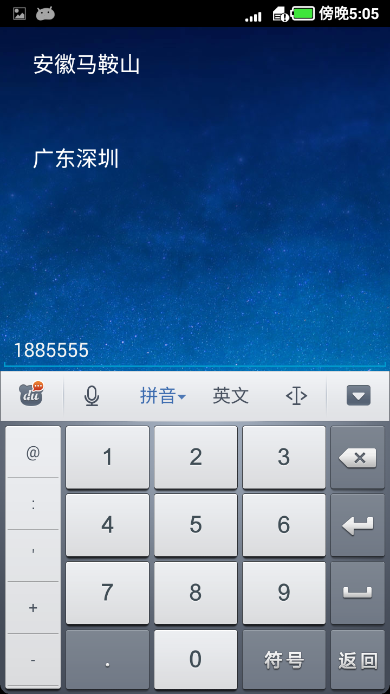

来去电归属地（数据库实现）
-----------

支持七位自动查询

也支持既定号码查询
（demo中既定号码为：18565710000）

+ 原理和方法：

http://www.waitingfy.com/archives/549

+ 图片：

+ 新增自定义Framelayout，获取归属地方式，详见 new_view里面的DEMO

+ 新增来去电监听，自动展现归属地。详见 new_view里面的DEMO
